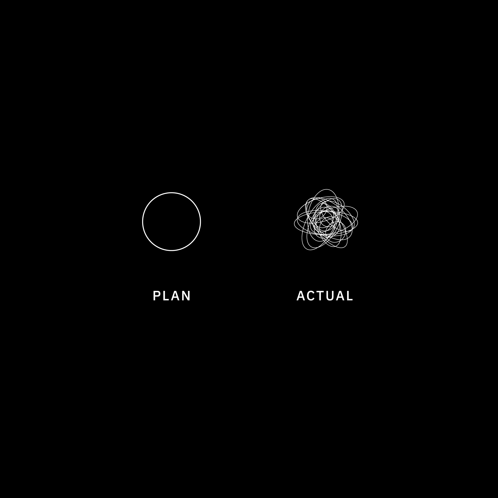
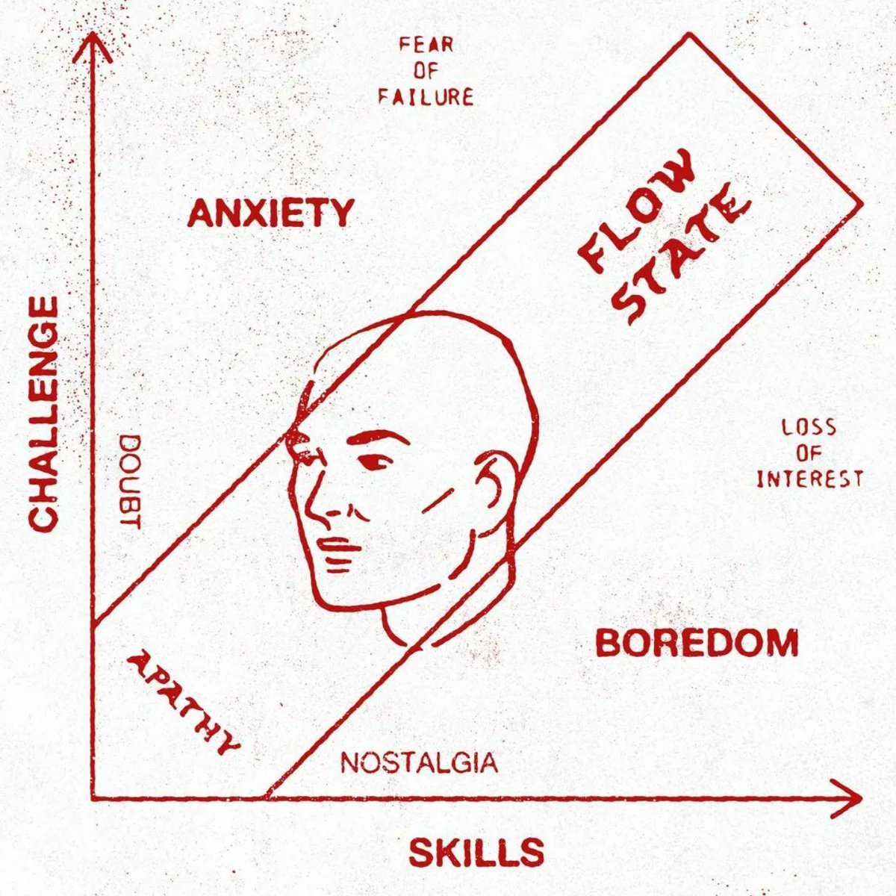

### CS340lx aut'26: (even more) advanced systems labs

  

Official description:
  - This is an implementation-heavy, lab-based class that continues the
    topics from CS240LX. The labs will be more specialized, with an emphasis
    on research-worthy topics and techniques. The class format will follow
    CS240LX: two labs, twice a week, along with a set of research papers
    for context.

Grading:
  1. Midterm project.
  2. Final project.
  3. Our Labs + any labs you make.
  4. No robot usage for the main labs.  Ok for projects or
     (possibly) some huge extension after finishing main lab in with
     your own bare hands.

Context:
 - Final class in the 140e/240lx pipeline (as of rn :).
 - We only offer it every few years when there is an unusual group + lots of
   emo-blackmail text messages (you know who you are).  Lots of great alumni!
 - This is the 4rd offering.
 - Joseph graduated, so it's Max and me now.
 - First couple weeks will likely have more chaos b/c of reasons discussed
   in class.  

Structure:
 - 140e and 240lx have to fulfill class requirements, so content somewhat
   constrained.  
 - 340lx we build whatever seems interesting --- only rule is we build
   and you have a working example of a cool trick or deep method every
   lab.  In general: we go broader on fun stuff (devices), go deeper on
   interesting stuff than the simple examples in previous labs.
 - One fantastic difference: Around half of the labs are usually
   student-written.  You have already suffered through 30+ labs
   as consumers, so now is your chance to build the labs you would have 
   wanted.   
   This is my favorite part of the class.  I always learn a lot.  The new
   labs give tricks useful for 140e/240lx.  And based on past performance
   (eg Stuart's 2025 elf lab) these labs can >>> better than our staff ones :)

What's the big picture goal: 
 - Do a bunch of cool devices for fun.  Since we have a limited
   enrollment, can afford more expensive ones (lidar, screens, kilometer
   capable LoRa RF)
 - Do a bunch of new sbc's --- arm, riscv, whatever.
   Often boot-up is the most difficult part, so it's good to have
   a portfolio.  Also once you see more, you start to get a feel for
   what is an arbitrary choice and which is fundamental.
 - Now that you have a solid grasp of low-level hardware and code, we 
   build more advanced stuff, and go much deeper.    
   From the past: build a RISC-v simulator that can simulate itself and
   is register equivalent with the hardware.
 - Build simple versions of advanced techniques in other areas.
   Some examples from the past:
     - Build a SAT solver (Matthew)
     - Build a constraint solver (Matthew)
     - Static analysis bug finders (Matthew and Manya),
     - Verilog FPGA examples (Zack)

-------------------------------------------------------------------
### Possible labs

  

Some possible good labs from 240lx final projects
 - Stuart's elf debug: use to make a real profiler.
 - Quake (Sai and James): will do screen and keyboard labs
 - pico (Gabe?) 
 - Pi zero 2 (Benji): 4 armv7 processor, faster, still bcm2835.
 - Fuse?

Likely devices:
  - class D amplifier + speaker
  - HDMI screen
  - Lidar
  - camera?
  - sbcs: pico 2, pico, ox64, pi zero 2

Tentative things I'd like to do (won't do all)
  - Doing more Turing complete DMA (based on Max Cura's hack) 
  - Speed up interrupts/exceptions by 50x.
  - A solid network boot loader that works over RF, sound, light, IR.
    It's wild to send code using sound or a blinky light.
  - A few projects putting together several devices.
    (e.g., accel controlled lights, acoustically reactive displays)
    Key: use tricks to verify the system so you're suprised if it breaks.
  - Make a bunch of stuff really, really fast.  Fun hack is write code
    on your pi that beats linux/macos on your fancy modern laptop ---
    e.g., exceptions or tiny processes so you can quickly fork 100,000
    (versus crashing your laptop).
  - Finally build the runtime tools we were discussing: eraser race detector, 
    volatile checker.
  - Do much better versions of 140e labs so can pull them in: ideally
    a simple complete OS.  definitely a better fast FAT32

The basic play: we've spend a couple quarters learning a lot of low-level
stuff the hard way.  Now reap the rewards using it to build the cool
stuff.

  

